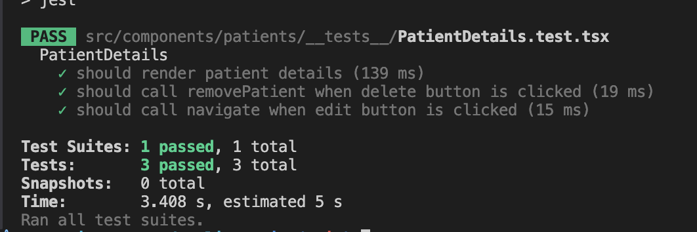

# Patient Records Client

## Requirements

- Node 18.3

## Setup

- Start patient-records-service (https://github.com/ozzell/patient-records-service) first
- Run `npm install` to install dependencies
- Run `npm run dev` to start the dev server
- The app will be available at http://localhost:5173

## Test Results

## Still to do

- Add more unit tests (only a couple are implemented)
- Add E2E tests
- Add user input validation on the client side
- Add more error handling
- Add more logging
- Improve UI/UX
- Make dates user friendly
- Fix dates in the edit form (they are not displayed)
- Cleanup styles
- Think about how to handle long names / long medical conditions in list view
- Implement caching
- Implement pagination
- Implement sorting
